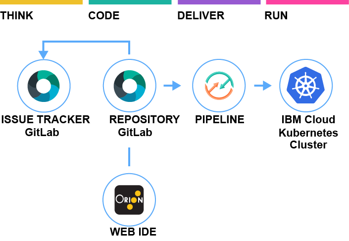

#  Develop a Kubernetes app

### Continuously deliver a secure Docker app to a Kubernetes Cluster
This Hello World application uses Docker with Node.js and includes a DevOps toolchain that is preconfigured for continuous delivery with Vulnerability Advisor, source control, issue tracking, and online editing, and deployment to the IBM Bluemix Containers service.

Application code is stored in source control, along with its Dockerfile and its Kubernetes deployment script.
The target cluster is configured during toolchain setup (using a Bluemix API key and cluster name). You can later change these by altering the Delivery Pipeline configuration.
Any code change to the Git repo will automatically be built, validated and deployed into the Kubernetes cluster.

### To get started, click this button:

---
### Learn more 

* Blog [Continuously deliver your app to Kubernetes with Bluemix](https://www.ibm.com/blogs/bluemix/2017/07/continuously-deliver-your-app-to-kubernetes-with-bluemix/)
* Step by step [tutorial](https://www.ibm.com/devops/method/tutorials/tc_secure_kube)
* [Getting started with Bluemix clusters](https://console.bluemix.net/docs/containers/container_index.html?pos=2)
* [Getting started with toolchains](https://bluemix.net/devops/getting-started)
* [Documentation](https://console.ng.bluemix.net/docs/services/ContinuousDelivery/index.html?pos=2)
